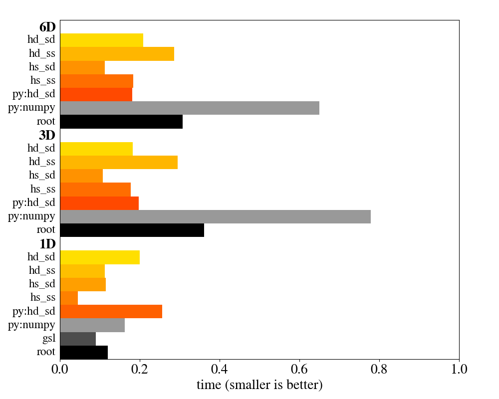

# Histogram

**Fast multi-dimensional histogram with convenient interface for C++11 and Python**

[](https://travis-ci.org/HDembinski/histogram?branch=master) [](https://coveralls.io/github/HDembinski/histogram?branch=master)

This `C++11` library provides a multi-dimensional [histogram](https://en.wikipedia.org/wiki/Histogram) class for your statistics needs. It is very customisable through policy classes, but the default policies were carefully designed so that most users won't need to customize anything. In the standard configuration, this library offers a unique safety guarantee not found elsewhere: bin counts *cannot overflow* or *be capped*. While being safe to use, the library also has a convenient interface, is memory conserving, and faster than other libraries (see benchmarks).

The histogram class comes in two variants which share a common interface. The *static* variant uses compile-time information to provide maximum performance, at the cost of runtime flexibility and potentially larger executables. The *dynamic* variant is a bit slower, but configurable at run-time and may produce smaller executables. Python bindings for the latter are included, implemented with `Boost.Python`.

The histogram supports value semantics. Histograms can be added and scaled. Move operations and trips over the language boundary from C++ to Python and back are cheap. Histogram instances can be streamed from/to files and pickled in Python. [Numpy](http://www.numpy.org) is supported to speed up operations in Python: histograms can be filled with Numpy arrays at high speed (in most cases several times faster than numpy's own histogram function) and are convertible into Numpy array views without copying data.

My goal is to submit this project to [Boost](http://www.boost.org), that's why it uses the Boost directory structure and namespace. The code is released under the [Boost Software License](http://www.boost.org/LICENSE_1_0.txt).

Check out the [full documentation](http://hdembinski.github.io/histogram/doc/html/). Highlights are given below.

## Features

* Multi-dimensional histogram
* Simple and convenient interface in C++ and Python
* Static and dynamic implementation in C++ with common interface
* Counters cannot overflow or be capped (+)
* Better performance than other libraries (see benchmarks for details)
* Efficient move operations
* Efficient conversion between static and dynamic implementation
* Efficient use of memory (counter capacity dynamically grows as needed)
* Support for many mappings of input values to bin indices (user extensible)
* Support for weighted increments
* Support for under-/overflow bins (can be disabled individually for each dimension)
* Support for variance tracking (++)
* Support for addition and scaling of histograms
* Support for serialization based on `Boost.Serialization`
* Support for Python 2.x and 3.x
* Support for Numpy

(+) In the standard configuration, if you don't use weighted increments.
(++) If you don't use weighted increments, variance tracking come at zero cost. If you use weighted increments, extra space is reserved internally to keep track of a variance counter per bin. The conversion happens automatically and transparently.

## Dependencies

* [Boost](http://www.boost.org)
* Optional: [CMake](https://cmake.org) [Python](http://www.python.org) [Numpy](http://www.numpy.org)

## Build instructions

The library can be build with `b2` within the boost directory structure, but if you are not a boost developer, use `cmake` instead.

```sh
git clone https://github.com/HDembinski/histogram.git
mkdir build && cd build
cmake ../histogram/build
make # or 'make install'
```

To run the tests, do `make test`.

### Trouble-shooting when compiling with Python support

If you compile the library with Python support (the default if Python is found) and have several versions of Python installed, `cmake` will pick the latest Python version by default. Please make sure that this is the same version that Boost.Python and Boost.Numpy were compiled against, otherwise you will get strange errors during compilation and/or at runtime. You can force `cmake` to pick a specific Python version with the PYTHON_VERSION flag. For example, to force the use of Python2.7, do: `cmake -DPYTHON_VERSION=2.7 ../histogram/build`

In the future, the build system may be able to pick the right Python version automatically, but right now it has to be done manually.

If you installed Boost with `brew` on OSX, also have a look at this [Stackoverflow](https://stackoverflow.com/questions/33653001/unable-to-link-against-boost-python-on-os-x) question.

## Code examples

For the full version of the following examples with explanations, see
the [Getting started](http://hdembinski.github.io/histogram/doc/html/histogram/getting_started.html) section in the documentation.

Example 1: Fill a 1d-histogram in C++

```cpp

int main(int, char**) {
    namespace bh = boost::histogram;
    using namespace bh::literals; // enables _c suffix

    /*
      create a static 1d-histogram with an axis that has 6 equidistant
      bins on the real line from -1.0 to 2.0, and label it as "x"
    */
    auto h = bh::make_static_histogram(
      bh::axis::regular<>(6, -1.0, 2.0, "x")
    );

    // fill histogram with data, typically this happens in a loop
    // STL algorithms are supported
    auto data = { -0.5, 1.1, 0.3, 1.7 };
    std::for_each(data.begin(), data.end(), h);

    /*
      a regular axis is a sequence of semi-open bins; extra under- and
      overflow bins extend the axis in the default configuration
      index   :     -1    0    1   2   3   4   5   6
      bin edge:  -inf -1.0 -0.5 0.0 0.5 1.0 1.5 2.0 inf
    */
    h(-1.5); // put in underflow bin -1
    h(-1.0); // put in bin 0, bin interval is semi-open
    h(2.0);  // put in overflow bin 6, bin interval is semi-open
    h(20.0); // put in overflow bin 6

    /*
      do a weighted fill using bh::weight, a wrapper for any type,
      which may appear at the beginning of the argument list
    */
    h(bh::weight(1.0), 0.1);

    /*
      iterate over bins with a fancy histogram iterator
    */
    for (auto it = h.begin(); it != h.end(); ++it) {
      const auto bin = it.bin(0_c);
      std::cout << "bin " << it.idx(0) << " x in ["
                << bin.lower() << ", " << bin.upper() << "): "
                << it->value() << " +/- "
                << std::sqrt(it->variance())
                << std::endl;
    }

    /* program output: (note that under- and overflow bins appear at the end)

    bin 0 x in [-1.0, -0.5): 1 +/- 1
    bin 1 x in [-0.5,  0.0): 0 +/- 0
    bin 2 x in [ 0.0,  0.5): 1 +/- 1
    bin 3 x in [ 0.5,  1.0): 0 +/- 0
    bin 4 x in [ 1.0,  1.5): 1 +/- 1
    bin 5 x in [ 1.5,  2.0): 0 +/- 0
    bin 6 x in [ 2.0, inf): 2 +/- 1.41421
    bin -1 x in [-inf, -1): 1 +/- 1

    */
}
```

Example 2: Fill a 2d-histogram in Python with data in Numpy arrays

```python
    import histogram as bh
    import numpy as np

    # create 2d-histogram over polar coordinates, with
    # 10 equidistant bins in radius from 0 to 5 and
    # 4 equidistant bins in polar angle
    h = bh.histogram(bh.axis.regular(10, 0.0, 5.0, "radius", uoflow=False),
                     bh.axis.circular(4, 0.0, 2 * np.pi, "phi"))

    # generate some numpy arrays with data to fill into histogram,
    # in this case normal distributed random numbers in x and y,
    # converted into polar coordinates
    x = np.random.randn(1000)             # generate x
    y = np.random.randn(1000)             # generate y
    radius = (x ** 2 + y ** 2) ** 0.5
    phi = np.arctan2(y, x)

    # fill histogram with numpy arrays; call looks as
    # if radius and phi are numbers instead of arrays
    h(radius, phi)

    # access histogram counts (no copy)
    count_matrix = np.asarray(h)

    print count_matrix

    # program output:
    #
    # [[37 26 33 37]
    #  [60 69 76 62]
    #  [48 80 80 77]
    #  [38 49 45 49]
    #  [22 24 20 23]
    #  [ 7  9  9  8]
    #  [ 3  2  3  3]
    #  [ 0  0  0  0]
    #  [ 0  1  0  0]
    #  [ 0  0  0  0]]
```

## Benchmarks

Thanks to meta-programming and dynamic memory management, this library is not only safer, more flexible and convenient to use, but also faster than the competition. In the plot below, its speed is compared to classes from the [GNU Scientific Library](https://www.gnu.org/software/gsl), the [ROOT framework from CERN](https://root.cern.ch), and to the histogram functions in [Numpy](http://www.numpy.org). The orange to red items are different compile-time configurations of the histogram in this library. More details on the benchmark are given in the [documentation](http://hdembinski.github.io/histogram/doc/html/histogram/benchmarks.html)



## Rationale

There is a lack of a widely-used free histogram class in C++. While it is easy to write a one-dimensional histogram, writing a general multi-dimensional histogram is not trivial. Even more so, if you want the histogram to be serializable and have Python-bindings and support Numpy. In high-energy physics, the [ROOT framework](https://root.cern.ch) from CERN is widely used. This histogram class is designed to be more convenient, more flexiable, and faster than the equivalent ROOT histograms. This library comes in a clean and modern C++ design which follows the advice given in popular C++ books, like those of [Meyers](http://www.aristeia.com/books.html) and [Sutter and Alexandrescu](http://www.gotw.ca/publications/c++cs.htm).

Read more about the design choices in the [documentation](http://hdembinski.github.io/histogram/doc/html/histogram/rationale.html)

## State of project

The histogram is feature-complete. More than 500 individual tests make sure that the implementation works as expected. Full documentation is available. User feedback is appreciated!

As we are finalising the interface in the review process, code breaking changes of the interface are not unlikely to happen. If you want to use the library in production code, please use the [latest release](https://github.com/HDembinski/histogram/releases) instead of the master. After the library is accepted as part of Boost, the interface will be kept stable, of course.

Review of the library was planned to happen in March 2018, but is delayed.
